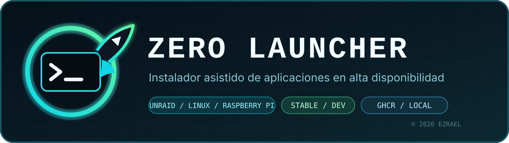
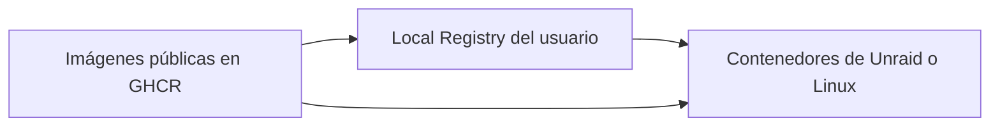

<p align="center">
  
</p>

<p align="center">
  
  
  
  <a href="LICENSE"></a>
</p>

<p align="center">
  <strong>Instala la suite desde la terminal de Unraid o Linux sin crear contenedores a mano.</strong>
</p>

Zero Launcher es un asistente interactivo para instalar y comprobar cinco
aplicaciones Docker en Unraid y Linux, incluida Raspberry Pi. Detecta el sistema,
solicita únicamente los puertos y rutas que Docker necesita y prepara plantillas
para Unraid o archivos Compose para Linux. En Unraid cada contenedor queda
visible y editable en su página Docker.

Cada aplicación se instala como **un único contenedor**.

El **modo simulador** permite recorrer una instalación completamente nueva en
este ordenador o en un servidor en producción. Descarga únicamente las
plantillas para examinarlas y no escribe en el `boot`, no descarga imágenes ni
crea contenedores.

> [!IMPORTANT]
> La versión publicada actual es la 1.0.1. Antes de utilizarla en un servidor con
> aplicaciones existentes, revisa el resumen que muestra antes de ejecutar
> cualquier cambio.

## Aplicaciones

| Aplicación | Función | Imagen pública |
|---|---|---|
| **Local Registry** | Almacén local de imágenes Docker | `ghcr.io/ezr43l/local-registry-s` |
| **Keepalived** | Direcciones flotantes y alta disponibilidad | `ghcr.io/ezr43l/keepalived-s` |
| **RTFM** | Documentación técnica y procedimientos | `ghcr.io/ezr43l/rtfm-s` |
| **NPM Guardian** | Sincronización de Nginx Proxy Manager | `ghcr.io/ezr43l/npm-guardian-s` |
| **Vault Guardian** | Gestión y réplica de Vaultwarden | `ghcr.io/ezr43l/vault-guardian-s` |

## Formas de instalación

Zero Launcher ofrece dos orígenes fáciles de distinguir:

| Origen | Qué sucede |
|---|---|
| **Imágenes públicas desde GHCR** | Docker obtiene directamente las imágenes públicas. Es la opción recomendada. |
| **Imágenes locales desde Local Registry** | Zero Launcher guarda primero las imágenes en el registro del propio servidor y la instalación apunta a esas copias. |

GitHub sólo proporciona Zero Launcher, la documentación y las plantillas. No es
necesario instalar Gitea ni proporcionar credenciales de GitHub.

## Cómo funciona Local Registry

Si se eligen imágenes locales, Zero Launcher comprueba primero si Local
Registry ya está instalado:

- Si está funcionando, lo reutiliza.
- Si está detenido, lo arranca sin reinstalarlo.
- Si no existe, solicita sus dos puertos y su ruta de almacenamiento, crea la
  carpeta si hace falta y lo instala antes de continuar.
- Si existe pero está averiado, lo conserva y detiene el proceso para no crear
  instalaciones incompletas.

Local Registry siempre obtiene **su propia imagen desde GHCR**. Así puede
arrancar y recuperarse aunque su almacén local esté detenido.



## Recorrido del asistente

```text
ZERO LAUNCHER
│
├── 1. Instalar aplicaciones
├── 2. Simular una instalación nueva
├── 3. Comprobar instalaciones
├── 4. Acerca de Zero Launcher
└── 0. Salir y guardar el registro

INSTALACIÓN O SIMULACIÓN
│
├── 1. Elegir GHCR o Local Registry
├── 2. Elegir una, varias o todas las aplicaciones
├── 3. Comprobar qué versiones están publicadas
├── 4. Preparar Local Registry si se ha elegido
├── 5. Detectar las demás instalaciones existentes
├── 6. Solicitar los puertos y rutas necesarios
├── 7. Mostrar y confirmar el plan completo
└── 8. Instalar y comprobar el resultado
```

Cuando sólo existe `stable`, se selecciona automáticamente. Si una aplicación
sólo dispone de `dev`, el asistente advierte que podría no ser estable antes de
continuar. Zero Launcher no utiliza la etiqueta `latest`.

## Qué solicita

El asistente pregunta únicamente por los valores que Docker debe conocer antes
del primer arranque:

- puertos publicados;
- directorios persistentes;
- rutas locales que alguna aplicación necesita montar.

La selección de aplicaciones utiliza una lista interactiva:

- `↑` y `↓` desplazan el cursor;
- la barra espaciadora marca o desmarca;
- Enter confirma la selección;
- «Instalar todas», situada al final, activa o desactiva el conjunto completo.

Las cuatro aplicaciones aparecen inicialmente desmarcadas. Local Registry no
forma parte de esta lista: si se eligió como origen, Zero Launcher lo detecta,
arranca o instala automáticamente antes de continuar.

Al pulsar Intro se usa el valor mostrado cuando la plantilla dispone de uno.
Si un campo obligatorio no tiene un valor universal, Zero Launcher lo indica
y muestra un ejemplo sin confundirlo con un valor predeterminado. En el modo
simulador se puede aceptar ese ejemplo con Intro para continuar; durante una
instalación real se debe introducir la ruta correcta del servidor. Si una ruta
final no existe, se crea. Las cuentas, nodos, credenciales, sincronización y
demás ajustes funcionales se completan después desde la interfaz web de cada
aplicación.

Una carpeta nueva de datos de RTFM se prepara con propietario `10001:10001`
y permisos `0700`, necesarios para que la aplicación escriba en ella. Esto se
aplica tanto a Unraid como a Linux. Si la carpeta ya existe, Zero Launcher no
cambia sus permisos ni su propietario: debe permitir escritura a ese usuario.

Al terminar una instalación o simulación, Zero Launcher regresa al menú
principal. Al elegir Salir solicita la carpeta en la que se guardará el
registro completo de la sesión. La ruta propuesta es:

```text
/mnt/user/appdata/zero-launcher
```

En Linux se propone `/var/log/zero-launcher`. Se puede indicar cualquier otra
ruta absoluta, también durante una simulación. El archivo se guarda como
`zero-launcher-AAAAMMDD-HHMMSS.log`, sin colores ni controles de pantalla,
para poder compartirlo al solicitar ayuda.

## Respeto por instalaciones existentes

Zero Launcher distingue entre una aplicación no instalada, arrancada,
detenida o averiada. Nunca elimina un contenedor por estar detenido ni crea un
duplicado con el mismo nombre.

Antes de ejecutar presenta una tabla con la aplicación, el origen de su imagen,
la versión y la acción prevista. El usuario puede cancelar sin realizar
cambios.

## Plantillas de Unraid

Las plantillas personalizadas se guardan en:

```text
/boot/config/plugins/dockerMan/templates-user/
```

Si una plantilla ya existe y debe actualizarse, se conserva primero una copia
en:

```text
/boot/config/zero-launcher/backups/templates/<fecha>/
```

Los contenedores creados mantienen su icono, acceso a la interfaz web y opción
de edición dentro de DockerMan.

## Uso

Descarga la publicación actual y comprueba que el archivo está completo:

```bash
curl -fL \
  https://github.com/Ezr43l/zero-launcher-s/releases/latest/download/zero-launcher.sh \
  -o /tmp/zero-launcher.sh

curl -fL \
  https://github.com/Ezr43l/zero-launcher-s/releases/latest/download/zero-launcher.sh.sha256 \
  -o /tmp/zero-launcher.sh.sha256

cd /tmp
sha256sum --check zero-launcher.sh.sha256
chmod +x zero-launcher.sh
./zero-launcher.sh
```

En Linux, para instalar realmente, ejecuta `sudo bash /tmp/zero-launcher.sh`.
La simulación no necesita permisos de administrador. Zero Launcher requiere
Bash 4 o posterior; en Windows se puede recorrer el simulador con Git Bash,
pero no instalar las aplicaciones para servidores desde Windows.

## Linux y Raspberry Pi

No hay que escoger un sistema operativo antes del menú: se detecta
automáticamente y aparece bajo el título. Sólo el simulador pregunta qué
entorno quieres representar.

| Entorno | Instalación | Preparación automática de Docker |
|---|---|---|
| Unraid con Docker habilitado | Plantilla XML y DockerMan | Utiliza el Docker de Unraid; no instala ni actualiza paquetes del servidor |
| Debian 12 o 13, 64 bits | Un archivo Compose por aplicación | Repositorio oficial de Docker, con confirmación |
| Ubuntu 22.04, 24.04 o 26.04 LTS, 64 bits | Un archivo Compose por aplicación | Repositorio oficial de Docker, con confirmación |
| Raspberry Pi OS de 64 bits, basado en Debian 12 o 13 | Un archivo Compose por aplicación | Paquetes Debian ARM64 del repositorio oficial de Docker, con confirmación |
| Otros Linux de 64 bits | Un archivo Compose por aplicación | El usuario debe tener preparados Docker Engine y `docker compose` |

Raspberry Pi requiere Pi 3 o posterior y un sistema operativo **de 64 bits**.
El procesador puede ser de 64 bits y tener instalado un sistema de 32 bits:
ese caso no es compatible con las imágenes de esta suite. No se instala Docker
Desktop ni se emulan arquitecturas.

| Elemento | Ruta propuesta en Linux |
|---|---|
| Datos persistentes | `/srv/appdata/<aplicación>`; cada ruta se puede cambiar en el asistente |
| Archivos de instalación | `/opt/zero-launcher/<aplicación>/compose.yaml` |
| Registro de la sesión | `/var/log/zero-launcher`; se puede cambiar al salir |

La generación de Compose reutiliza la plantilla pública como referencia de
puertos, montajes y permisos. No escribe en `/boot` en Linux. Cada archivo
contiene exactamente un servicio y no construye imágenes: utiliza la imagen
publicada del canal elegido. Si ya existe su archivo, guarda una copia antes
de reemplazarlo. Una aplicación existente no se reinstala ni cambia de origen.

Para consultar una instalación Linux posteriormente:

```bash
sudo docker compose -p zero-keepalived \
  -f /opt/zero-launcher/keepalived/compose.yaml ps
sudo docker compose -p zero-keepalived \
  -f /opt/zero-launcher/keepalived/compose.yaml logs --tail=100
```

Sustituye `keepalived` por la aplicación y conserva la ruta que hayas elegido.
El directorio base Compose se puede personalizar antes de arrancar mediante
`sudo ZERO_LAUNCHER_COMPOSE_DIR=/ruta/zero-launcher bash /tmp/zero-launcher.sh`.

> [!WARNING]
> Keepalived necesita acceso a la red real del servidor y permisos de red.
> Las IP flotantes y la comunicación entre nodos se configuran en su portal,
> no en Zero Launcher. NPM Guardian necesita un NPM ya instalado y sus rutas
> reales de datos y certificados; esas rutas no se crean vacías en Linux.
> Vault Guardian necesita el socket Docker local y la carpeta de las instancias
> que quieras administrar. Instalar la aplicación no configura por sí mismo
> un grupo de alta disponibilidad ni garantiza conectividad entre servidores.

Si falta Docker, el asistente enumera los paquetes necesarios y pide
autorización. Si detecta paquetes incompatibles, no los borra. Si Docker está
instalado pero detenido, pregunta antes de arrancar su servicio; nunca reinicia
un motor en funcionamiento. No habilita automáticamente Docker al arrancar el
sistema. Revisa también tu cortafuegos: los puertos Docker pueden eludir reglas
de herramientas como UFW. Las instrucciones de preparación siguen la
[documentación oficial para Debian](https://docs.docker.com/engine/install/debian/)
y [Ubuntu](https://docs.docker.com/engine/install/ubuntu/).

> [!NOTE]
> Esta versión se ha comprobado con casos concretos y recorridos del simulador.
> No se ha realizado una instalación limpia real en cada distribución ni una
> prueba de alta disponibilidad con Raspberry Pi. Los fallos de uso se irán
> corrigiendo en las siguientes versiones.

Para recorrer el asistente sin escribir plantillas ni crear contenedores:

```bash
./zero-launcher.sh --dry-run
```

Para simular además que se trata de un Unraid nuevo, aunque el equipo tenga ya
las cinco aplicaciones instaladas, ejecuta Zero Launcher y elige
`Simular una instalación nueva` en el menú principal:

```bash
./zero-launcher.sh
```

> [!CAUTION]
> Revisa el script y su suma SHA-256 antes de ejecutarlo como `root`. No uses
> copias procedentes de enlaces o repositorios de terceros.

## Seguridad y limpieza

- No guarda credenciales de GitHub ni Gitea.
- No introduce secretos de las aplicaciones en las plantillas.
- No escribe directamente en las bases de datos de las aplicaciones.
- No elimina contenedores, volúmenes ni versiones anteriores.
- Retira sus archivos temporales al salir. Si la ejecución se interrumpe antes
  de guardar el registro, conserva esa copia temporal y muestra su ubicación.
- Si la creación de un contenedor falla, retira únicamente ese contenedor
  incompleto que acaba de crear.

## Comprobaciones del proyecto

Las comprobaciones se ejecutan en nuestros equipos antes de publicar. GitHub
recibe los archivos terminados y no ejecuta construcciones ni pruebas.

```bash
bash scripts/preflight.sh
```

## Soporte

El soporte se presta exclusivamente en la comunidad de Discord de Unraides:

**[Entrar en la comunidad de Unraides](https://discord.gg/8MAT6ZGJTW)**

Al pedir ayuda, incluye el sistema operativo y su versión, la versión de Zero Launcher, las aplicaciones
seleccionadas y el mensaje de error. No publiques contraseñas, tokens ni
archivos privados.

## Licencia

Zero Launcher se distribuye bajo la [licencia Apache 2.0](LICENSE).

Copyright © 2026 Ezrael.

Unraid es una marca de Lime Technology, Inc. Este proyecto es comunitario y no
está afiliado, patrocinado ni respaldado oficialmente por Lime Technology.
