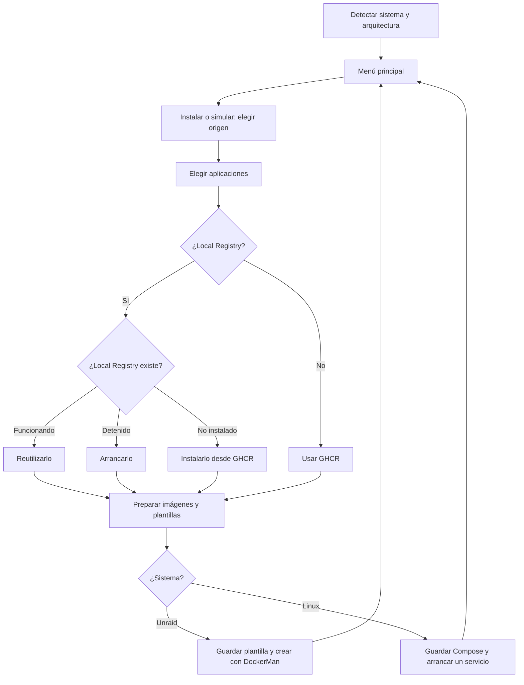

# Arquitectura de Zero Launcher

## Objetivo

Zero Launcher realiza una instalación asistida desde la terminal de Unraid o
Linux y termina sin dejar servicios auxiliares. Cada aplicación continúa siendo
un único contenedor: administrable desde DockerMan en Unraid o mediante su
archivo Compose en Linux.

## Decisiones permanentes

1. Una aplicación equivale a un contenedor.
2. Las imágenes proceden de GHCR o de Local Registry.
3. GitHub y Gitea no intervienen en la instalación de los contenedores.
4. `stable` es el canal recomendado; `dev` podría no ser estable.
5. Sólo se muestran canales que tengan una imagen publicada.
6. No se utiliza `latest`.
7. Local Registry se instala desde GHCR y nunca depende de sí mismo.
8. Una instalación existente se conserva, incluso si está detenida.
9. La plantilla o archivo Compose anterior se guarda antes de sustituirlo.
10. La configuración funcional se completa dentro de cada aplicación.
11. El simulador fuerza un servidor vacío y no modifica la instalación ni
    interactúa con el motor Docker. Sí prepara archivos temporales y permite
    guardar el registro de la sesión al salir.
12. Se detectan automáticamente el sistema operativo y la arquitectura; no se
    añade un menú previo al menú principal.
13. Las dependencias del sistema sólo se instalan o arrancan con autorización.
14. No se instalan imágenes Windows ni se emulan plataformas; se requieren
    sistemas Linux Intel/AMD o ARM de 64 bits.

## Modo simulador

El simulador reutiliza exactamente las mismas pantallas, plantillas y
validaciones de la instalación normal, con estas sustituciones:

- presenta las cuatro aplicaciones seleccionables como no instaladas;
- ignora los puertos ocupados del equipo real;
- representa Local Registry como ausente para recorrer su instalación inicial;
- no comprueba ni monta el socket Docker;
- no escribe en el `boot`, no guarda Compose ni crea rutas de datos de aplicaciones;
- no descarga imágenes ni crea o arranca contenedores;
- elimina sus plantillas temporales al volver al menú.

Se inicia desde «Simular una instalación nueva» en el menú principal. En ese
momento pregunta si se quiere representar Unraid, Debian, Ubuntu o Raspberry Pi
OS de 64 bits. La antigua opción `--simulator` se acepta por compatibilidad,
pero no salta el menú principal.

## Selección múltiple

Las cuatro aplicaciones de usuario se eligen mediante una lista interactiva
controlada con las flechas, la barra espaciadora y Enter. Todas aparecen
desmarcadas inicialmente. La última fila, «Instalar todas», permite marcar o
desmarcar el conjunto.

Local Registry no aparece en esa lista. La elección del origen se realiza
antes y, cuando se escoge Local Registry, Zero Launcher lo añade como requisito
automático, reutilizándolo, arrancándolo o instalándolo según su estado.

Cuando no existe una terminal interactiva —por ejemplo durante una prueba
automatizada— se conserva una entrada de texto compatible para poder recorrer
el asistente sin simular pulsaciones de teclado.

## Flujo de decisión



## Plantilla única

La plantilla pública de la rama `main` es la referencia para cada aplicación.
Zero Launcher modifica una copia temporal:

- cambia `Repository` al canal y origen seleccionados;
- desactiva `TemplateURL` cuando se usa Local Registry, evitando que una
  actualización remota vuelva a cambiar el origen;
- introduce los puertos y rutas elegidos por el usuario;
- conserva nombre, red, permisos, icono, interfaz web y opciones adicionales.

En Unraid la copia final se instala en
`/boot/config/plugins/dockerMan/templates-user/` antes de crear el contenedor.
En Linux esta copia es temporal y se transforma en un archivo Compose; nunca
se importa en el `boot`.

## Instalación Linux

`/etc/os-release` identifica la distribución sin ejecutar su contenido como
código. Unraid se reconoce mediante sus archivos propios. `uname` identifica
el sistema y la arquitectura real del sistema operativo.

| Dato | Linux | Unraid |
|---|---|---|
| Datos propuestos | `/srv/appdata` | `/mnt/user/appdata` |
| Definición persistente | `/opt/zero-launcher/<app>/compose.yaml` | Plantilla XML de DockerMan |
| Registros propuestos | `/var/log/zero-launcher` | `/mnt/user/appdata/zero-launcher` |

La transformación conserva red host/bridge, usuario, reinicio, init, sistema de
archivos de sólo lectura, capacidades, tmpfs, límites de procesos, opciones de
seguridad, hosts adicionales, etiquetas, puertos, variables y rutas. Las
cadenas YAML se entrecomillan y se escapan para no introducir interpolaciones
accidentales. Una opción desconocida detiene la instalación; no se descarta.

Cada archivo tiene un servicio y un nombre oficial de contenedor. El proyecto
Compose se llama `zero-<app>`. Se valida su formato antes de persistirlo y se
arranca con `up -d --no-build --pull never`, utilizando la imagen que ya se ha
descargado. Los montajes usan rutas existentes y no permiten a Compose crear
automáticamente una carpeta en lugar de un socket. Los datos NPM existentes
no se crean vacíos. El resto de directorios se crea explícitamente si falta.

Si falta Docker o Compose, Debian 12/13, Ubuntu 22.04/24.04/26.04 y Raspberry Pi
OS de 64 bits basado en Debian 12/13 pueden prepararse desde el repositorio
oficial previa confirmación. No se desinstalan paquetes conflictivos, no se
actualiza deliberadamente un Docker ya instalado ni se reinicia un motor
funcionando. Comprobar instalaciones nunca instala paquetes ni arranca Docker.
En otras distribuciones deben existir Docker y su complemento Compose.

## Creación del contenedor

Zero Launcher convierte los campos conocidos de la plantilla en una orden
Docker segura:

| Campo de plantilla | Resultado |
|---|---|
| `Port` | Publicación del puerto elegido |
| `Path` | Montaje persistente y creación de la carpeta si falta |
| `Variable` | Variable necesaria antes del primer arranque |
| `Network` | Red `bridge` o `host` declarada |
| `ExtraParams` | Reinicio, límites y permisos definidos por el proyecto |
| `WebUI` e `Icon` | Acciones visibles en DockerMan |

También añade las marcas que permiten a Unraid administrar el contenedor. Si
la creación falla, elimina exclusivamente el contenedor incompleto creado en
esa operación.

## Detección

La detección usa el nombre oficial de cada contenedor. Para Local Registry se
acepta además una instalación única cuya imagen sea `local-registry` o
`local-registry-s`.

Los estados se tratan así:

| Estado | Acción |
|---|---|
| No instalado | Preparar e instalar |
| Funcionando | Conservar sin cambios |
| Detenido | Arrancar sin reinstalar |
| Pausado, reiniciándose o averiado | Informar y no modificar |

## Preparación local de imágenes

```text
GHCR ── descarga ──► Docker del servidor ── copia ──► Local Registry
                                                        │
                                                        ▼
                                              plantilla personalizada
```

Si la etiqueta ya existe en Local Registry, se reutiliza. Si no existe, se
descarga desde GHCR, se copia al registro local y se vuelve a descargar para
confirmar que puede utilizarse.

## Escrituras

1. Las descargas se realizan en un directorio temporal bajo `/tmp`.
2. Se valida que cada plantilla describa exactamente un contenedor esperado.
3. El usuario introduce los valores Docker.
   Los campos sin valor universal se solicitan como obligatorios. El simulador
   puede aportar ejemplos ficticios para permitir el recorrido sin convertirlos
   en valores predeterminados de una instalación real.
4. Se muestra el plan completo y se solicita confirmación.
5. La plantilla previa se guarda con fecha y hora.
6. La nueva plantilla se escribe primero con un nombre temporal y se renombra.
7. Se prepara la imagen y se crea el contenedor.
8. Se comprueba que el contenedor quede arrancado y, si define salud, esté sano.
9. Los archivos temporales se eliminan al finalizar.

## Registro de la sesión

Zero Launcher conserva la salida de la sesión en un archivo temporal mientras
se utiliza. Al elegir Salir, el usuario puede indicar una carpeta o aceptar
`/mnt/user/appdata/zero-launcher` en Unraid o `/var/log/zero-launcher` en Linux.
El archivo definitivo elimina colores y
controles propios de la terminal para que resulte legible al compartirlo.

La selección interactiva no vuelca cada movimiento del cursor. En su lugar, el
registro anota una sola vez la lista final de aplicaciones elegidas. Las
entradas ocultas, como posibles secretos, no se escriben en el registro.
Los valores Docker no ocultos elegidos en el asistente también se anotan para
poder comprobar las rutas y puertos realmente utilizados.

## Límites deliberados

- No cambia la configuración interna de las aplicaciones.
- No migra automáticamente una instalación existente entre GHCR y Local
  Registry.
- No elimina imágenes antiguas, contenedores detenidos ni volúmenes.
- No crea ni sincroniza repositorios Gitea.
- No delega trabajo en tareas automáticas de GitHub.
- No instala sistemas operativos ni añade soporte ARM de 32 bits.
- No configura por sí mismo la comunicación ni el grupo de alta disponibilidad.
- No afirma haber probado una instalación real nueva en cada distribución.
